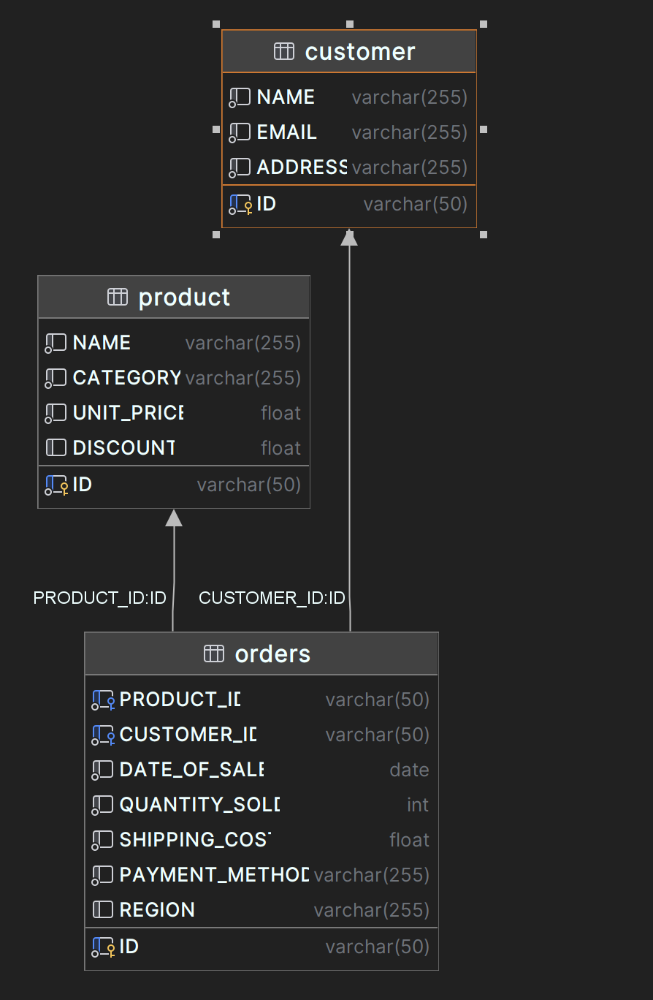

# lumel-backend

# Schema diagram
- Customer
- Product
- Order



# APIs

| Method | URL       | Request | Response                    |
|--------|-----------|--------------|-----------------------------|
| GET    | /load-csv | None | SUCCESS \| PARTIAL \| ERROR 
| GET    | /totalCustomers         | startDate, endDate | {"error": "","count": 2}    |
| GET    | /totalOrders         | startDate, endDate | {"error": "","count": 3}    |


GET /load-csv
[Example: http://localhost:8080/load-csv](http://localhost:8080/load-csv)


# Instructions to run (Windows)

```./mvnw clean install```